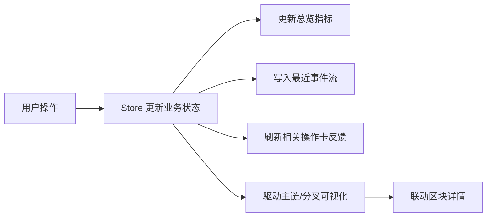
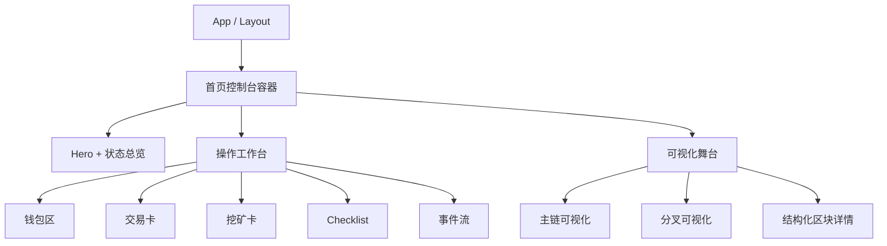

# Blockchain Visualizer UI/UX 优化设计

- 日期：2026-03-25
- 项目：`blockchain-visualizer`
- 状态：已确认，可进入实现规划

## 1. 背景

当前项目已经具备钱包创建、交易发起、区块挖矿、区块链展示、网络模拟、分叉模拟和新手教程等核心功能，但整体体验仍偏向“功能堆叠”：

- 首页模块权重接近，用户难以快速判断当前系统状态和下一步动作。
- 高价值操作如发交易、挖矿、创建分叉缺少明确反馈，动作结果感不足。
- 可视化区域与操作区联动较弱，演示时不够像完整产品。
- 新手引导只在弹窗中一次性出现，后续缺少持续提示。

本次优化目标不是重写业务逻辑，而是在沿用现有 React + Zustand + shadcn/ui + D3 技术栈的前提下，系统性升级首页信息架构、操作效率和视觉完成度。

## 2. 目标与边界

### 2.1 目标

本次迭代重点同时满足“交互效率优先”和“展示效果优先”，产品定位为“两者都要”的混合型项目。

具体目标：

- 让用户进入首页后能一眼读懂系统现状。
- 让高频动作更顺手，形成“操作 -> 反馈 -> 观察结果 -> 下一步”的闭环。
- 让界面更具现代产品化质感，适合作品展示与课堂演示。
- 保留教学属性，但避免让引导成为重弹窗打断式体验。

### 2.2 非目标

本期不包含以下范围：

- 多页面路由重构
- 真实链网络、节点同步或后端服务扩展
- 账户体系、权限体系
- 复杂动画系统或高成本视觉特效
- 与当前目标无关的大规模 store 重写

## 3. 用户决策摘要

本次设计基于以下已确认方向：

- 优先级：`交互效率 + 展示效果`
- 产品定位：`两者都要`
- 首页结构：`混合式`
- 视觉气质：`现代产品化`
- 功能增强范围：`状态总览 + 操作反馈 + 轻量事件流`
- 引导策略：`首次轻量引导 + 首页持续提示`

## 4. 当前问题诊断

### 4.1 信息架构问题

- 当前首页采用多模块均分布局，页面节奏平，缺少主次分层。
- 钱包、交易、挖矿、区块详情之间缺少统一的主任务路径。
- 区块详情以原始 JSON 展示，阅读成本高，不利于演示。

### 4.2 交互问题

- 创建交易后缺少明显成功反馈和下一步引导。
- 挖矿虽然是高价值动作，但缺少过程状态和结果摘要。
- 钱包列表信息暴露过多，操作关联过弱。
- 网络模拟启停只有开关，没有足够系统级反馈。

### 4.3 展示问题

- 页面目前更像课程实验页面，而不是完成度高的交互式产品。
- 可视化区域样式基础，缺少舞台感和状态强调。
- 视觉层级不够稳定，重要信息没有被突出。

## 5. 选定方案

采用“混合式控制台首页”方案。

该方案在保留现有功能模块的前提下，重组首页为“总览 + 工作台 + 可视化舞台”的三段式结构，兼顾高频操作效率、系统状态感和可演示性。

推荐原因：

- 最符合“交互效率 + 展示效果”目标。
- 可以自然承载状态总览、操作反馈和事件流。
- 可复用现有核心逻辑，主要调整展示层与 UI 状态层。
- 不会把项目推向重型重构，风险和回退成本可控。

## 6. 信息架构与页面布局

### 6.1 首页总体结构

首页重构为三段式混合控制台：

1. 顶部：Hero + 系统总览
2. 中部：操作工作台
3. 下部：链路可视化舞台

### 6.2 顶部 Hero + 系统总览

顶部区域承担“读懂系统状态”和“发起关键动作”的职责。

内容包括：

- 标题与一句产品化副标题
- 4 到 5 个核心状态卡片
- 1 组主操作入口

建议状态卡：

- 钱包数量
- 待确认交易数量
- 主链高度
- 最新区块哈希缩略值
- 网络模拟状态

建议主操作：

- 创建钱包
- 发起交易
- 开始挖矿

状态卡的数据源与刷新规则如下：

| 指标 | 数据源 | 刷新时机 |
|------|--------|----------|
| 钱包数量 | `wallets.length` | 创建钱包后立即刷新 |
| 待确认交易数量 | `pendingTransactions.length` | 交易加入交易池、交易被打包移除时刷新 |
| 主链高度 | 主链 `blocks.length` 或最新区块索引 | 挖矿成功、分叉解决导致主链变化时刷新 |
| 最新区块哈希缩略值 | 主链最后一个区块的 `hash` | 主链新增区块或主链切换时刷新 |
| 网络模拟状态 | 本地 UI 状态 `isSimulating` | 启停网络模拟时立即刷新 |

### 6.3 中部操作工作台

中部区域负责提升交互效率，采用“左主右辅”布局。

- 左侧主区：交易卡、挖矿卡
- 右侧辅区：快速开始 Checklist、最近事件流
- 钱包区作为资产与入口区域，采用更紧凑卡片式设计

这样可以把用户注意力聚焦在“让系统动起来”的操作上，而不是把屏幕空间优先让给原始数据展示。

### 6.4 下部可视化舞台

下部区域升级为“结果观察层”。

- 主链可视化为主舞台
- 分叉可视化为次级舞台
- 区块详情改为联动结构化详情面板，而不是独立 JSON 面板

### 6.5 响应式策略

- 移动端：总览 -> 操作 -> 事件流 -> 可视化 纵向堆叠
- 桌面端：总览单独成层，中部左右分区，下部宽幅舞台
- 长文本、哈希、公钥、私钥默认截断，仅在次级详情或展开态中展示

## 7. 核心交互设计

### 7.1 钱包管理

钱包区从“信息陈列”调整为“资产卡片 + 快捷操作入口”。

展示字段优先级：

- 钱包标识（可继续使用地址缩略）
- 当前余额
- 关键快捷动作

次级信息：

- 公钥、私钥折叠展示
- 完整地址仅在需要时显示

交互要求：

- 钱包为空时，提供显著空状态和“创建第一个钱包”入口
- 每个钱包卡可快速触发“用于发交易”与“设为挖矿奖励地址”
- 钱包区支持更高密度展示，避免占据过多首屏空间

### 7.2 交易创建

交易卡升级为带即时反馈的主操作卡。

交互要求：

- 对未选择钱包、自转账、金额非法、余额不足等情况给出清晰提示
- 提交成功后提供明确反馈：“交易已加入待确认池”
- 成功后同步更新：
  - 顶部待确认交易数
  - 最近事件流
  - 下一步建议，如“现在可以去挖矿确认它”

### 7.3 区块挖矿

挖矿卡升级为“过程感”更强的操作面板。

交互要求：

- 明确展示当前待打包交易数量
- 明确展示奖励接收钱包
- 点击挖矿后出现处理中状态
- 成功后展示结果摘要：
  - 新区块高度
  - 打包交易数量
  - 矿工奖励
- 若无可打包交易，仍允许挖矿生成空块，但必须在操作前和结果反馈中明确说明“本次挖出的是空块”

### 7.4 最近事件流

新增轻量事件流组件，作为系统“时间感”来源。

事件流记录最近关键动作：

- 创建钱包
- 发起交易
- 交易进入待确认池
- 挖出新区块
- 创建分叉
- 解决分叉
- 开启/停止网络模拟

每条事件包含：

- 事件类型
- 摘要文案
- 相对时间
- 相关对象缩略信息

事件流要求：

- 默认仅保留最近 20 条，避免无限增长
- 文案偏“人话”，不直接暴露技术细节
- 与顶部状态卡和关键操作结果联动刷新

### 7.5 引导与持续提示

保留现有 `Tutorial`，但职责调整为“首次轻量引导”。

引导策略分两层：

- 首次进入：用更短、更聚焦的步骤介绍核心路径
- 后续使用：首页保留快速开始 Checklist

Checklist 建议项：

- 创建一个钱包
- 发起一笔交易
- 挖出一个新区块
- 查看链上变化

该策略既保留教学属性，又减少反复打断。

## 8. 视觉系统设计

### 8.1 视觉方向

整体采用“现代产品化”为主的界面风格。

原则：

- 亮色界面为主
- 使用有层次的浅灰背景，而不是纯白平铺
- 主色采用蓝青或蓝绿色系
- 状态色清晰区分成功、进行中、警告、分叉等语义

### 8.2 组件层级

需要建立更清楚的组件等级：

- 状态卡：扁平、紧凑、便于扫读
- 主操作卡：更高视觉权重，更明确 CTA
- 数据卡：用于钱包、区块详情、辅助信息
- 可视化舞台卡：宽幅、边界稳定、强调主要观察区域

### 8.3 动效策略

动效仅服务反馈，不追求炫技。

建议动效：

- 状态卡数值变更的轻微过渡
- 提交交易、挖矿成功后的联动高亮
- 新区块出现时的轻量强调
- 首屏卡片的轻微分段出现效果

### 8.4 可视化区升级

可视化目标不是更复杂，而是更清楚。

主链视图要求：

- 强调当前主链
- 突出最新区块
- 支持点击区块查看结构化详情

分叉视图要求：

- 主链与分叉链样式统一
- 用稳定状态标签区分主链与分叉
- 与创建分叉/解决分叉动作有明确联动

区块详情要求：

- 使用结构化字段展示
- 不默认展示整段 JSON
- 重点突出区块高度、哈希、前序哈希、交易数量、时间戳、Nonce

## 9. 组件与状态层调整

本次改动遵循“复用逻辑、升级展示、补充 UI 状态”的原则。

### 9.1 新增组件

建议新增：

- `DashboardHero` 或等价首页总览组件
- `SystemStatCards`
- `QuickActions`
- `RecentActivityFeed`
- `QuickStartChecklist`
- `StructuredBlockDetails`

### 9.2 现有组件调整

保留并重做展示层的组件：

- `Wallet`
- `Transaction`
- `BlockMining`
- `BlockchainVisualization`
- `BlockchainForkVisualization`
- `Tutorial`

### 9.3 状态层补充

在现有 Zustand store 基础上，补充轻量 UI/体验状态：

- 最近事件列表
- 首次引导完成状态的继续沿用或扩展
- 当前选中钱包、默认奖励钱包等便捷交互状态
- 可视化选中区块状态

要求：

- 不把复杂展示逻辑塞回已有业务 slice
- UI 状态与链逻辑状态保持边界清晰

## 10. 数据流与联动

核心联动链路如下：

关键事件的写入与刷新规则如下：

| 事件 | 触发来源 | 写入时机 | 联动更新 |
|------|----------|----------|----------|
| 创建钱包 | `createWallet` | 钱包创建成功后立即写入 | 钱包数、钱包区 |
| 发起交易 | `addPendingTransaction` | 交易加入待确认池后立即写入 | 待确认交易数、交易卡 |
| 挖出新区块 | 挖矿成功逻辑 | 区块加入主链后立即写入 | 主链高度、最新区块、可视化舞台 |
| 创建分叉 | `addChain` | 分叉链创建成功后立即写入 | 分叉舞台 |
| 解决分叉 | `resolveChainFork` | 主链切换或分叉消解后立即写入 | 主链高度、主链/分叉舞台 |
| 网络模拟启停 | `isSimulating` 切换 | 开启/关闭时立即写入 | 模拟状态卡、事件流 |

所有状态卡和事件流默认采用“同步提交后立即刷新”的策略，不引入额外轮询。

首页编排层与现有组件的关系如下：

## 11. 错误处理与反馈原则

所有关键动作采用统一反馈策略：

- 动作前：说明是否满足执行条件
- 动作中：提供处理中反馈
- 动作后：提供结果摘要和下一步建议
- 出错时：使用用户可理解的提示，不只暴露技术错误

重点场景：

- 钱包为空
- 余额不足
- 无法选择有效接收方
- 未设置挖矿奖励地址
- 当前无区块或无主链
- 网络模拟启动但缺少足够钱包

## 12. 验证要求

本次属于用户可见行为优化，验证强度按“运行证据 + 行为验证”执行。

至少验证以下场景：

- 钱包为空时的首页空状态
- 创建 1 个钱包和多个钱包后的表现
- 交易成功、失败、非法输入时的反馈
- 挖矿前后总览、事件流、主链视图是否同步
- 网络模拟启停时状态是否同步反映到总览与事件流
- 首次引导与后续 Checklist 的切换逻辑
- 主链与分叉视图在桌面端和移动端是否可读

建议验证方式：

- 本地运行截图/手动操作验证
- 基础 lint/build 验证

## 13. 实施边界

第一期应完成：

- 首页重组
- 全局状态总览
- 钱包、交易、挖矿交互重做
- 最近事件流
- 快速开始 Checklist
- Tutorial 轻量化改造
- 区块详情结构化展示
- 主链/分叉视图样式统一

第一期不应扩展：

- 新业务模型
- 跨页面导航
- 重型数据持久化设计
- 高成本视觉实验

## 14. 成功标准

完成后应满足：

- 用户进入首页后能快速理解系统当前状态
- 高频操作路径比当前更短、更明确
- 每个关键动作都有清楚反馈与下一步引导
- 可视化区域与操作结果具备明显联动
- 页面更像成熟交互式产品，而非功能集合页
