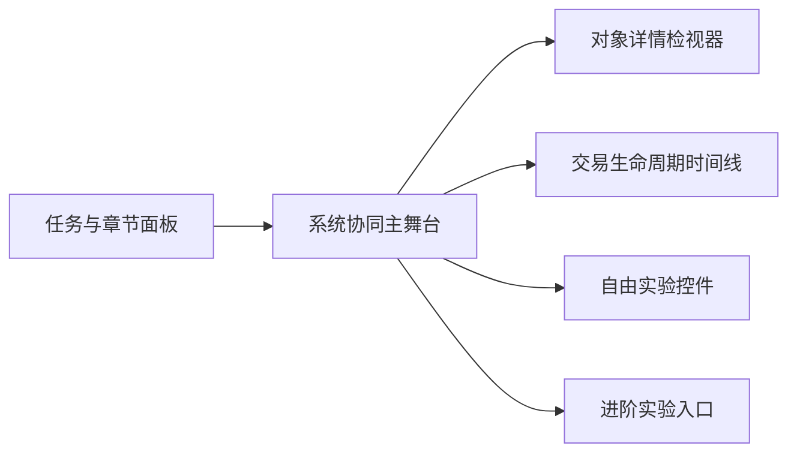

# 区块链协同实验室重构设计

- 日期：2026-03-29
- 项目：`blockchain-visualizer`
- 状态：已确认，进入实现规划
- 目标用户：有一点区块链基础认知，但还没有把角色协同和关键流程真正串起来的学习者

## 1. 背景

当前系统已经具备钱包创建、交易发起、挖矿、主链展示、网络模拟和分叉模拟等功能，但产品表达严重偏离“演示区块链进程和原理”的初衷。

主要问题不是功能缺失，而是组织方式错误：

- 首页把钱包、交易、挖矿、链可视化、网络模拟、分叉模拟并列铺开，像功能面板集合，不像教学产品。
- 新手教程是一次性弹窗，介绍的是“有哪些模块”，不是“系统如何协同运转”。
- 用户看到的是独立工具，而不是一笔交易如何在钱包、节点、矿工、区块链之间流转。
- 进阶机制与主线内容没有分层，分叉和网络模拟过早占据注意力。

这次重构的目标，不是做“更好看的控制台”，而是把产品重构为一个真正围绕“多角色协同 + 一笔交易上链过程”组织的学习系统。

## 2. 产品目标与边界

### 2.1 核心目标

V1 必须帮助用户在 5 到 10 分钟内建立下面三层理解：

1. 主目标：理解区块链是一个多角色协同系统，钱包、节点、矿工、区块链如何互相作用。
2. 次目标 1：理解一笔交易从发起、广播、进入待打包、被矿工打包到上链确认的完整生命周期。
3. 次目标 2：理解区块、Hash、Nonce、PoW 之间的基本关系，以及它们在“挖矿”中的作用。

### 2.2 交互策略

产品采用“引导主线 + 自由实验”的双模结构：

- 先用半自动引导主线讲清一条完整流程。
- 再让用户在同一套舞台中自由改参数、重跑场景、观察变化。
- 分叉、网络延迟、多链竞争等进阶内容降级到独立实验区，不打扰主线。

### 2.3 非目标

V1 不追求以下内容：

- 真实区块链级别的协议复杂度
- 完整密码学推导或签名算法教学
- 多页面课程体系
- 后端节点网络或真实链同步
- 同时覆盖所有进阶机制

## 3. 设计结论

采用“引导式实验室 + 自由实验”的双模工作台方案。

这个方案的核心不是把模块重新排版，而是重构用户理解路径：

- 从“我看到哪些功能”切换到“我现在处于哪一步”
- 从“点开不同组件”切换到“沿一条系统流程观察角色互动”
- 从“看字段结果”切换到“理解状态为什么变化”

最终产品气质为：

- 骨架像教学实验室：清晰、克制、步骤感强
- 关键节点像科技演示台：有明显的流转感、动态感和舞台感

## 4. 信息架构

### 4.1 顶层导航

顶层信息架构从“模块并列”改为“学习阶段并列”：

1. `主线引导`
2. `自由实验`
3. `进阶实验`
4. `术语索引 / 帮助`

用户第一眼必须知道自己正在经历哪种学习模式，而不是面对一排互不统摄的功能块。

### 4.2 主界面骨架

主界面采用三栏 + 一条底部时间线的结构：

- 左侧：任务与章节面板
- 中间：系统协同主舞台
- 右侧：对象详情检视器
- 底部：交易生命周期时间线

职责分配如下：

- 左侧回答：`我现在要做什么`
- 中间回答：`系统此刻正在发生什么`
- 右侧回答：`为什么会这样`
- 底部回答：`这件事在整个流程里走到了哪一步`

### 4.3 架构图

## 5. 主线引导交互设计

### 5.1 引导原则

主线模式采用“半自动”交互：

- 用户只触发关键动作
- 系统自动演示传播、竞争和状态更新
- 所有关键过程都支持暂停、单步和回看

这比“全自动播放”更有参与感，也比“每个细节都手动操作”更聚焦学习目标。

### 5.2 主线步骤

推荐的第一条学习主线为：

1. 选择一个发送钱包
2. 发起一笔交易
3. 观察交易广播到节点
4. 观察交易进入 mempool
5. 用户点击开始挖矿
6. 观察矿工尝试 Nonce / 计算 Hash / 形成候选区块
7. 观察新区块接入主链
8. 观察交易状态变为已确认

### 5.3 主线中的用户控制

主线中保留四类控制：

- `播放 / 暂停`
- `单步前进`
- `回看上一状态`
- `解释层级切换（基础 / 深入）`

其中“解释层级切换”是 V1 的重要设计点：

- 基础层：解释正在发生什么
- 深入层：解释 Hash、Nonce、PoW、交易池等概念和原因

### 5.4 主线结束后的分流

主线结束后提供两个明确出口：

1. `继续自由实验`
2. `进入进阶实验`

这两个出口必须显式出现，不能要求用户自己猜测“接下来去哪继续玩”。

## 6. 核心界面模块设计

### 6.1 左侧：任务与章节面板

左侧面板替代当前的一次性教程弹窗，成为持续存在的学习引导区。

它至少承担 3 件事：

- 显示当前任务目标
- 指示下一步操作
- 解释刚刚发生了什么

建议内容结构：

- 当前章节
- 当前任务
- 下一步按钮或提示
- 关键术语卡片
- 可展开的“为什么会这样”

### 6.2 中间：系统协同主舞台

中间主舞台是整个产品唯一的核心视觉中心。

它不再把钱包、交易、挖矿、区块链拆成多个平级大卡片，而是统一呈现为一个协同场景：

- 钱包 / 用户
- 节点 / 交易池
- 矿工
- 主链

在主舞台里，用户应该可以直接看到：

- 交易卡片从钱包流向节点
- 交易进入 mempool
- 矿工选择交易并打包
- Nonce / Hash 尝试过程
- 新区块接入主链

实现边界说明：

- V1 中的“节点”首先是教学角色和可视化对象，不要求一次性引入完整独立节点数据模型。
- 如果现有 store 结构不足以表达真实节点网络，允许先用“网络接收者 / 交易池承载者”的抽象角色承接演示。
- 计划和实现应优先保证教学表达清晰，而不是追求网络协议层面的精细模拟。

### 6.3 右侧：对象详情检视器

右侧不是字段展示区，而是“因果解释器”。

当用户点选交易、矿工、区块或钱包时，右侧需要回答：

- 当前对象是谁
- 当前状态是什么
- 为什么进入这个状态
- 下一步会影响谁

例如点选某笔交易时，右侧应同时展示：

- 发送方、接收方、金额、手续费
- 当前状态：已广播 / 待打包 / 挖矿中 / 已确认
- 当前卡住或推进的原因
- 关联矿工或关联区块

### 6.4 底部：交易生命周期时间线

底部时间线用来串起用户的流程感。

建议状态节点：

- 待签名
- 已广播
- 已进入交易池
- 正在挖矿
- 已确认

时间线是主线教学和自由实验的共用组件，用于持续提示“当前所处阶段”。

## 7. 视觉与交互原则

### 7.1 视觉原则

- 主舞台必须是视觉焦点
- 左右两栏是辅助，不应抢主舞台的权重
- 默认只显示当前任务相关信息，避免信息泛滥
- 关键状态变化必须有明显反馈
- 动效为理解服务，不为炫技服务

### 7.2 交互原则

- 所有关键动作都要有即时反馈
- 所有自动演示都要可暂停 / 可回看
- 所有教学解释都要支持分层，不强迫用户一次读完
- 所有进阶机制都必须下沉，不干扰主线

## 8. 现有模块的重构策略

### 8.1 保留并重构

- `Wallet`
  - 从独立大卡片改为主线动作和自由实验控件的一部分
- `Transaction`
  - 从单独表单卡改为主线任务动作入口
- `BlockMining`
  - 从独立操作区改为主线关键动作 + 过程可视化入口
- `BlockchainVisualization`
  - 从静态横向链图升级为系统协同主舞台
- `BlockDetails`
  - 保留为右侧详情能力，但重构为状态解释器

### 8.2 下沉为进阶实验

- `NetworkSimulation`
  - 从主页面默认内容改为进阶实验能力
- `BlockchainForkVisualization`
  - 从主页面默认内容改为进阶实验能力

### 8.3 取消当前表达方式

- `Tutorial`
  - 不再以首次弹窗形式出现
  - 其教学职责迁移到左侧任务与章节面板

## 9. V1 范围

### 9.1 V1 必做

- 一个默认进入的主线引导
- 一个可切换的自由实验模式
- 一套统一的系统协同主舞台
- 一套对象详情检视器
- 一条交易生命周期时间线
- 一个进阶实验入口，且至少落地一个主题页（优先分叉实验）

### 9.2 V1 可延后

- 多条教学主线
- 更复杂的网络延迟模拟
- 更复杂的矿工竞争表现
- 多层课程体系
- 深度术语词典

## 10. 成功标准

本次重构完成后，至少要满足以下验收条件：

- 用户第一次进入时能快速理解产品主线，而不是面对功能拼盘
- 用户能在 5 到 10 分钟内完整跑通一笔交易上链
- 用户能清楚看到钱包、节点、矿工、区块链之间的协同关系
- 用户能区分交易当前处于广播、待打包、挖矿中还是已确认状态
- 进阶实验存在，但不会干扰主线
- 首页结构体现“任务驱动 + 主舞台解释 + 右侧因果说明”，而不是旧式并列卡片布局

## 11. 风险与控制

### 11.1 主要风险

- 如果主舞台承载过多信息，容易再次变成“换皮控制台”
- 如果自动演示节奏过快，用户会觉得“看到了，但没看懂”
- 如果自由实验和主线引导是两套完全不同的界面，用户会产生割裂感

### 11.2 控制策略

- 严格限制主舞台默认信息量，只暴露当前任务相关状态
- 所有自动演示提供暂停、单步和回看
- 主线和自由实验共用同一套舞台结构，只切换任务层与控件层

## 12. 设计结论

这次重构的本质，不是视觉升级，而是把产品从“区块链功能展示页”重构成“区块链协同学习器”。

页面结构、交互主线、模块职责和信息层次都必须服务于这件事：

- 主线先讲清多角色协同
- 一笔交易上链作为最小教学故事
- PoW 作为支撑理解的次主线
- 分叉和网络模拟作为进阶实验下沉

只要后续实现仍然遵循这个边界，产品就会重新回到它最初应该服务的定位上。
